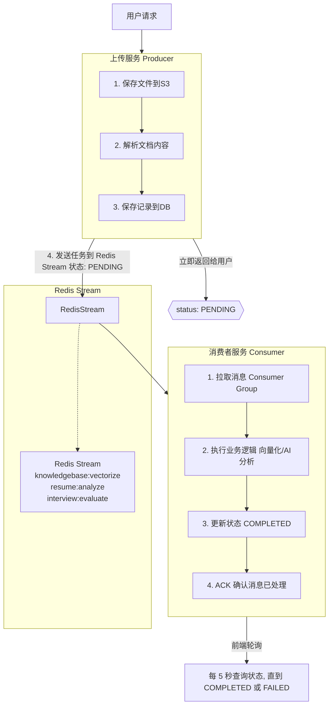

```mermaid
graph TD
%% === 核心流程定义 ===
%% 1. 用户请求发起
    UserRequest[用户请求] --> ProducerGroup

%% 2. Producer 服务处理
    ProducerGroup -->|4. 发送任务到 Redis Stream 状态: PENDING| RedisStream
ProducerGroup -->|立即返回给用户| UserResponse{{"status: PENDING"}}

%% 3. 消费者处理
RedisStream --> ConsumerGroup

%% 4. 前端轮询
ConsumerGroup -->|前端轮询| Frontend[每 5 秒查询状态, 直到 COMPLETED 或 FAILED]

%% === 分组：上传服务 (Producer) ===
subgraph ProducerGroup[上传服务 Producer]
direction TB
SaveS3[1. 保存文件到S3] --> ParseDoc[2. 解析文档内容]
ParseDoc --> SaveDB[3. 保存记录到DB]
end

%% === Redis Stream 组件 ===
subgraph RedisStreamComponent[Redis Stream]
RedisStream

note1[Redis Stream\nknowledgebase:vectorize\nresume:analyze\ninterview:evaluate]
RedisStream -.-> note1
end

%% === 分组：消费者服务 (Consumer) ===
subgraph ConsumerGroup[消费者服务 Consumer]
direction TB
PullMsg[1. 拉取消息 Consumer Group] --> ExecuteLogic[2. 执行业务逻辑 向量化/AI分析]
ExecuteLogic --> UpdateStatus[3. 更新状态 COMPLETED]
UpdateStatus --> AckMsg[4. ACK 确认消息已处理]
end


```