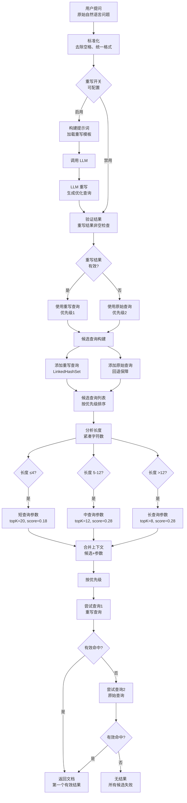

# 查询重写与动态检索流程分析报告

本报告基于三张流程图截图内容，整合生成完整的“查询重写与动态检索流程”Mermaid流程图，并附详细说明。该流程体现了现代智能检索系统中常见的查询优化机制，结合大语言模型（LLM）进行查询重写，并通过动态参数调整提升检索效果。

## 完整流程概述

整个流程可分为五大阶段：

1. **输入处理**：接收用户原始自然语言问题，进行标准化预处理。
2. **查询重写**：根据配置决定是否启用LLM进行查询重写，生成优化后的查询语句。
3. **候选查询构建**：基于重写结果的有效性，构建包含重写查询（优先级1）和原始查询（优先级2，作为回退）的候选列表。
4. **动态检索参数配置**：对每个候选查询进行长度分析（紧凑字符数），依据长度区间动态设定检索参数（topK 和 score 阈值）。
5. **候选检索执行**：按优先级顺序尝试检索，先使用重写查询，失败后再尝试原始查询；任一查询有效命中即返回首个结果，否则返回“无结果”。

## 动态检索参数配置规则

以下表格总结了不同查询长度对应的检索参数配置：

| 查询长度范围 | 查询类型   | topK 值 | Score 阈值 |
|--------------|------------|---------|------------|
| ≤4 字符      | 短查询参数 | 20      | 0.18       |
| 5–12 字符    | 中查询参数 | 12      | 0.28       |
| >12 字符     | 长查询参数 | 8       | 0.28       |

此策略体现“短查询召回更多候选（高topK），但相关性要求较低（低score）”，而长查询因本身更具体，故减少候选数量、提高匹配质量的要求。

## Mermaid 流程图代码

## 流程图说明

- **节点命名与功能**：
  - 使用平行四边形表示输入/输出（如“用户提问”、“返回文档”），但在Mermaid中统一用矩形简化表达。
  - 菱形表示判断节点（如“重写开关”、“有效?”）。
  - 矩形表示处理步骤或状态。
- **流程逻辑**：
  - 查询重写为可选功能，由系统配置决定是否启用。
  - 即使重写失败，原始查询仍作为“回退保障”加入候选列表，确保至少有一次检索机会。
  - 候选查询列表使用 `LinkedHashSet` 实现，既能保持插入顺序（优先级），又能自动去重。
  - 每个候选查询独立进行长度分析并绑定相应参数，体现“个性化检索策略”。
  - 检索尝试遵循“优先级顺序”，一旦成功立即终止流程，返回结果，提升效率。
- **异常处理**：
  - 重写结果无效或异常时，自动降级至原始查询。
  - 所有候选均未命中时，返回明确失败信号，便于上层系统处理。

该流程充分融合了AI重写能力与传统检索工程优化，兼顾准确性与鲁棒性，适用于问答系统、搜索引擎、推荐系统等场景。