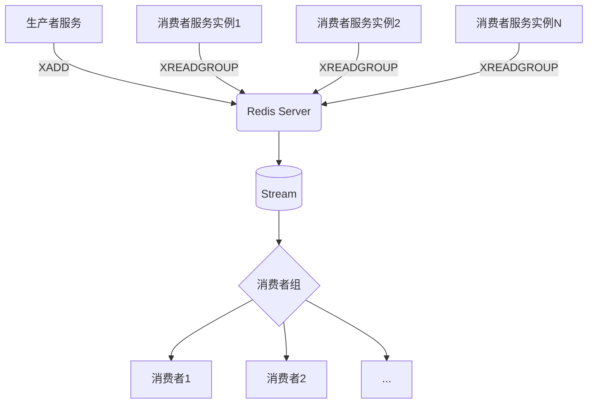

# 技术选型分析——基于Redis+RedisStream的异步任务架构设计

## 1. 引言

随着业务复杂度的增长，系统中出现了大量的异步任务需求，包括但不限于消息通知、数据同步、报表生成、邮件发送等。传统的定时轮询数据库方式存在实时性差、资源浪费等问题；而直接采用同步调用则会严重影响主流程性能与用户体验。

Redis作为内存数据库，凭借其高性能、丰富的数据结构以及持久化能力，在缓存之外也被广泛应用于消息队列场景。特别是Redis 5.0引入的**Redis Streams**特性，提供了类似Kafka的消息流模型，支持多播消费、消费者组、消息确认机制等功能，使其成为构建轻量级异步任务系统的理想选择。

本文将围绕“基于Redis + RedisStream”的异步任务架构展开详细的技术选型分析，涵盖核心原理、设计方案、性能评估、容错机制、监控策略等方面，旨在为企业级应用提供一套高效、可靠、易维护的异步任务解决方案。

## 2. 核心概念与技术背景

### 2.1 Redis Stream 基本模型

Redis Stream 是一种仅追加的日志型数据结构，专为消息传递设计。它具备以下关键特性：

- **消息ID**：每条消息拥有唯一且有序的时间戳ID，支持自动生成或手动指定。
- **消息字段**：每条消息由多个键值对组成，适合携带结构化任务参数。
- **消费者组 (Consumer Group)**：允许多个消费者协作处理同一个Stream中的消息，支持负载均衡与故障转移。
- **待处理消息列表 (Pending Entries List, PEL)**：记录已被读取但尚未确认处理完成的消息，用于实现ACK机制和重试。
- **阻塞读取**：`XREADGROUP`命令支持阻塞等待新消息到达，避免空轮询带来的CPU开销。

```bash
# 创建消费者组
XGROUP CREATE mystream mygroup $ MKSTREAM

# 消费者从组中读取消息（最多1条，阻塞5秒）
XREADGROUP GROUP mygroup consumer1 STREAMS mystream > TIMEOUT 5000 COUNT 1
```

### 2.2 为什么选择 Redis Streams？

| 对比项 | Redis Lists (BLPOP) | Redis Pub/Sub | Kafka | Redis Streams |
|-------|---------------------|---------------|--------|----------------|
| 消息持久化 | 否（除非开启AOF/RDB） | 否 | 是 | 是 |
| 多播支持 | 否（单播） | 是 | 是 | 是（通过消费者组） |
| 消费者偏移管理 | 无 | 无 | 有（ZooKeeper/KRaft） | 有（内部PEL） |
| 消息回溯 | 不支持 | 不支持 | 支持 | 支持（按ID查询） |
| 实时性 | 高 | 极高 | 中 | 高 |
| 运维成本 | 低 | 低 | 高 | 低 |

> 表格: 不同消息中间件对比 

综上所述，Redis Streams 在保持极简运维的同时，兼具了消息持久化、多播消费、偏移追踪等企业级功能，特别适用于中小型项目或对Kafka过度复杂的场景。

## 3. 架构设计与实现方案

### 3.1 整体架构图



### 3.2 关键模块职责划分

#### 生产者 (Producer)
- 将异步任务封装为JSON对象写入指定Stream。
- 使用`XADD`命令添加消息，并获取返回的消息ID。
- 可结合Lua脚本实现原子性的条件写入或限流控制。

#### 消费者 (Consumer)
- 属于某个预定义的消费者组，监听Stream中的新消息。
- 使用`XREADGROUP`以阻塞模式拉取消息，降低延迟。
- 处理成功后调用`XACK`提交ACK，否则可触发自动重试或人工干预。
- 定期执行`XPENDING`检查积压消息，防止任务丢失。

#### 监控与告警模块
- 通过`XINFO GROUPS`、`XINFO CONSUMERS`等命令采集运行指标。
- 统计未ACK消息数量、消费延迟、失败率等关键SLA。
- 集成Prometheus + Grafana进行可视化展示。
- 设置阈值告警（如积压超过1000条持续5分钟）。

## 4. 性能优化与最佳实践

### 4.1 写入性能调优

- **批量提交**：对于高频小任务，可通过`pipeline`合并多个`XADD`操作，减少网络往返。
- **合理分片**：当单一Stream吞吐达到瓶颈时，可根据业务维度（如租户ID、任务类型）进行Sharding，分散压力。
- **精简消息体**：避免在消息中传递大对象，建议只传ID，数据由消费者按需查询。

### 4.2 消费端稳定性保障

- **幂等性设计**：确保同一消息被重复处理不会产生副作用。常用手段包括：
  - 数据库唯一索引约束
  - Redis分布式锁 + 标记位（SETNX）
  - 版本号校验
- **死信队列(DLQ)**：当消息连续失败达到上限后，将其转移到专门的DLQ Stream，供后续排查与补偿。
- **自动伸缩**：配合Kubernetes HPA基于`pending count`指标动态扩缩消费者副本数。

### 4.3 容灾与数据安全

- **持久化配置**：启用AOF日志并设置`appendfsync everysec`，平衡性能与安全性。
- **主从复制**：部署Redis主从集群，保证节点宕机时仍可读取历史消息。
- **跨机房备份**：利用`redis-shake`等工具实现异地双活或多活架构。

## 5. 监控体系与可观测性

### 5.1 核心监控指标

| 指标名称 | 获取方式 | 告警阈值 | 说明 |
|---------|----------|----------|------|
| 流长度(Stream Length) | `XLEN` | > 10万条 | 判断是否有积压风险 |
| 消费者组成员数 | `XINFO GROUPS` | < 配置副本数 | 检测消费者是否全部上线 |
| 平均消费延迟 | 计算`(当前时间 - 消息ID时间戳)` | > 5分钟 | 反映处理效率 |
| 未ACK消息数 | `XPENDING` | > 1000条 | 表示处理异常或卡顿 |
| 消费速率(QPS) | 时间窗口内处理消息总数 | 波动±50% | 异常波动预警 |

### 5.2 日志与追踪集成

- 在消息中注入Trace ID，贯穿整个调用链路。
- 使用OpenTelemetry收集Span信息，接入Jaeger或SkyWalking。
- 消费者处理前后打印DEBUG日志，便于问题定位。


## 6. 局限性与替代方案

尽管Redis Streams具有诸多优势，但也存在一些局限性：

- **不支持消息过滤**：无法像Kafka那样根据Header或内容做路由筛选。
- **缺乏原生事务**：不能与其他Redis操作组成ACID事务。
- **扩展性有限**：不适合超大规模（TB级）消息堆积场景。

若未来业务增长导致上述限制成为瓶颈，可考虑以下演进路径：

1. **垂直升级**：迁移到云厂商托管的Tendis或Amazon MemoryDB for Redis。
2. **横向迁移**：逐步过渡到Apache Kafka或Pulsar，同时保留Redis用于缓存加速。
3. **混合架构**：热数据走Redis Streams，冷数据归档至Kafka，形成分层处理体系。


